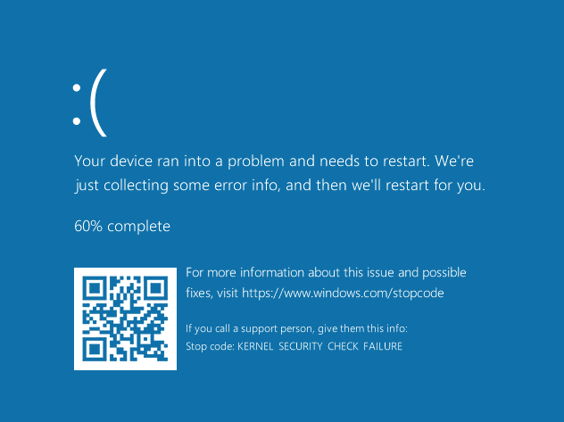

  

# NoPatchGuardCallback

x64 Windows PatchGuard Bypass, Register Process-Creation Callbacks

## What

This project is to bypass PatchGuard protection against `PsSetCreateProcessNotifyRoutine` by DKOM - *self register* arbitrary callback routine by directly manipulating kernel objects.

## Why

`PsSetCreateProcessNotifyRoutine` is the one of powerful NT Kernel API which allows driver to receive callbacks asynchronously.  
And it is protected by **PatchGuard** - The *Kernel Patch Protection* technology by Microsoft.

PatchGuard has a deep history of how it come in to the world - but not talk here.  

The PatchGuard protects **unsigned** code to be register callbacks by `PsSetCreateProcessNotifyRoutine`.  
`PsSetCreateProcessNotifyRoutineEx`, `PsSetCreateThreadNotifyRoutine` and `PsSetLoadImageNotifyRoutine` is not an exception, and many other.

When `PsSetCreateProcessNotifyRoutine` is called by the unsigned code, `KiRaiseSecurityCheckFailure` immediately interrupts and raises [bugcheck `0x139`](https://docs.microsoft.com/en-US/windows-hardware/drivers/debugger/bug-check-0x139--kernel-security-check-failure) eventually.

## License

MIT 🄫 Kento Oki \<hrn832@protonmail.com\>
